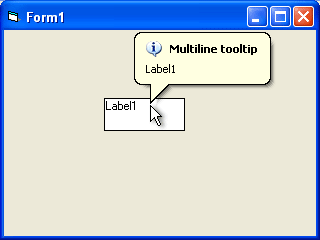



## Adding real Win32 tooltips for windowless controls \(Label, Image, etc\)

### Description

The attached code demonstrates an idea you can use to create real Win32 tooltips for windowless controls. The problem with Win32 tooltips is that you can attach it only to a control that provides the hwnd property returning the Win32 handle of the control. Some VB intrinsic controls such as Label do not have the hwnd property. The following trick allows you to create real Windows tooltips for these controls.

To do it, simply determine the moment when the mouse pointer has entered the area occupied by the required control, and create a tooltip for the FORM that contains the control. You need to detach the created tooltip from the form when the mouse pointer has left the control area; you can do it in the Form_MouseMove method.

The attached example shows how to create a multiline balloon tooltip for a Label control. Using this technique, you can create tooltips for any control that implements the MouseMove event (for instance, for Image control too).
 
### More Info
 

             |
---                |---
**Submitted On**   |2003-07-10 15:40:58
**By**             |[10Tec Company](https://github.com/Planet-Source-Code/PSCIndex/blob/master/ByAuthor/10tec-company.md)
**Level**          |Beginner
**User Rating**    |4.8 (58 globes from 12 users)
**Compatibility**  |VB 4\.0 \(32\-bit\), VB 5\.0, VB 6\.0
**Category**       |[Miscellaneous](https://github.com/Planet-Source-Code/PSCIndex/blob/master/ByCategory/miscellaneous__1-1.md)
**World**          |[Visual Basic](https://github.com/Planet-Source-Code/PSCIndex/blob/master/ByWorld/visual-basic.md)
**Archive File**   |[Adding\_rea1620377262003\.zip](https://github.com/Planet-Source-Code/10tec-company-adding-real-win32-tooltips-for-windowless-controls-label-image-etc__1-47179/archive/master.zip)

